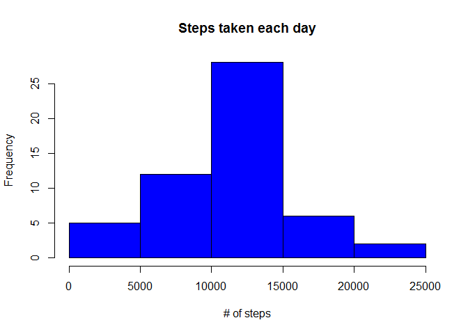

# Reproducible Research: Peer Assessment 1


## Loading and preprocessing the data


```r
Sys.setlocale("LC_TIME", "English")
library(data.table)
library(png)
library(grid)
library(ggplot2)

#Mode calculation function
Mode <- function(x) {week
  ux <- unique(x)
  ux[which.max(tabulate(match(x, ux)))]
}

int2nicetime <- function(nc) {
      #converting 5-min interval to Hours
      nice_time <- nc
      nice_time <- lapply(nice_time, toString)
      nice_time[nchar(nice_time)<3] <- paste("00", nice_time[nchar(nice_time)<3], sep = "")
      nice_time[nchar(nice_time)<4] <- paste("0", nice_time[nchar(nice_time)<4], sep = "")
      nice_time <- substr(nice_time,1,2)
      nice_time <- as.numeric(nice_time)
      #Converting Hours value to POSIXlt format for appropriate plotting
      as.POSIXlt(nice_time, origin = as.POSIXct(
                strptime("1970-01-01 00:00:00", "%Y-%m-%d %H:%M:%S", tz="Europe/Moscow")), format="%M")
      
}

unzip("activity.zip")
activity_raw <- data.table(read.csv("activity.csv"))
activity_raw_tidy <- activity_raw[complete.cases(activity_raw$steps),]
dir.create("figures")
```

## What is mean total number of steps taken per day?

```r
#replacing na's with nil
activity_raw_na0 <- activity_raw
activity_raw_na0[is.na(activity_raw_na0)] <-0


activity_sum_bydate <- activity_raw_tidy[,lapply(.SD, sum), by = "date"]
activity_sum_bydate <- activity_sum_bydate[, interval:=NULL]
par(mfrow = c(1,1))
png(filename = "figures/stepsbyday_hist.png", width = 480, height = 480)
hist(activity_sum_bydate$steps, col = "blue", xlab = "# of steps", 
     main = "Steps taken each day", bty = "l")
dev.off()
```

```
## png 
##   2
```

```r
#check this values
mean_steps <- mean(activity_sum_bydate$steps)
median_steps <- median(activity_sum_bydate$steps)
```
Mean steps is 1.0766189\times 10^{4}

## What is the average daily activity pattern?

```r
activity_sum_byint <- activity_raw_tidy[,lapply(.SD, sum), by = "interval"]
activity_sum_byint <- activity_sum_byint[, date:=NULL]
par(mfrow = c(1,1))
png(filename = "figures/stepsbyint_tsplot.png", width = 480, height = 480)
#converting 5-min interval to Hours
nice_time <- activity_sum_byint$interval
nice_time <- lapply(nice_time, toString)
nice_time[nchar(nice_time)<3] <- paste("00", nice_time[nchar(nice_time)<3], sep = "")
nice_time[nchar(nice_time)<4] <- paste("0", nice_time[nchar(nice_time)<4], sep = "")
nice_time <- substr(nice_time,1,2)
nice_time <- as.numeric(nice_time)
#Converting Hours value to POSIXlt format for appropriate plotting
nice_time <- as.POSIXlt(nice_time, origin = as.POSIXct(
    strptime("1970-01-01 00:00:00", "%Y-%m-%d %H:%M:%S", tz="Europe/Moscow")), format="%M")
plot(nice_time, activity_sum_byint$steps, type = "l", col = "red", xlab = "5-minutes interval", ylab = "# of steps", main = "Number of steps per 5-minute interval")
dev.off()
```

```
## png 
##   2
```

```r
#max steps per interval
max_int <- activity_sum_byint$interval[activity_sum_byint$steps == (max(activity_sum_byint$steps))]
```


## Imputing missing values

```r
#calculcating weekdays for each interval
sum_na_steps <- sum(is.na(activity_raw$steps))
weekdays_tidy <-  weekdays(as.POSIXlt(activity_raw_tidy$date))

activity_raw_tidy_w <- activity_raw_tidy[, weekday := weekdays_tidy]
activity_mean_byintweek <- activity_raw_tidy_w[,lapply(.SD, mean), by = "weekday,interval"]
activity_mean_byintweek <- activity_mean_byintweek[, date := NULL]
#activity_mean_byintweek <- data.table(activity_mean_byintweek[, date := NULL], key = "interval")
```


```r
#replacing NA steps with mean by interval and weekday
weekdays <-  weekdays(as.POSIXlt(activity_raw$date))
activity_na_rep <- activity_raw[, weekday := weekdays]

for (i in 1:length(activity_na_rep$steps)) {
  if (is.na(activity_na_rep$steps[i])){
    activity_na_rep$steps[i] <-
      activity_mean_byintweek$steps[activity_na_rep$interval[i]==activity_mean_byintweek$interval &
                                          activity_na_rep$weekday[i]==activity_mean_byintweek$weekday]
  }
}
```

```r
#task 1 for na replaced 
activity_nar_sum_bydate <- activity_na_rep[,weekdaytype:=NULL]
```

```
## Warning in `[.data.table`(activity_na_rep, , `:=`(weekdaytype, NULL)):
## Adding new column 'weekdaytype' then assigning NULL (deleting it).
```

```r
activity_nar_sum_bydate <- activity_nar_sum_bydate[,weekday:=NULL]
activity_nar_sum_bydate <-activity_nar_sum_bydate[,lapply(.SD, sum), by = "date"]
```

```r
activity_nar_sum_bydate <- activity_nar_sum_bydate[, interval:=NULL]
par(mfrow = c(1,1))
#png(filename = "figures/stepsbyday_hist_nar.png", width = 480, height = 480)
hist(activity_sum_bydate$steps, col = "blue", xlab = "# of steps", 
     main = "Steps taken each day", bty = "l")
```

 

```r
dev.off()
```

```
## null device 
##           1
```

```r
#mean and median for replaced
mean_steps_nar <- mean(activity_nar_sum_bydate$steps)
median_steps_nar <- median(activity_nar_sum_bydate$steps)
```


## Are there differences in activity patterns between weekdays and weekends?

```r
#creating column for weekdays\weekends
activity_na_rep$weekdaytype <- 0
activity_na_rep$weekdaytype[!grepl("^S",activity_na_rep$weekday)] <- "weekday"
activity_na_rep$weekdaytype[grepl("^S",activity_na_rep$weekday)] <- "weekend"
activity_mean_byint_wtype <- activity_na_rep[,date:=NULL]
activity_mean_byint_wtype <- activity_mean_byint_wtype[,weekday:=NULL]
```

```
## Warning in `[.data.table`(activity_mean_byint_wtype, , `:=`(weekday,
## NULL)): Adding new column 'weekday' then assigning NULL (deleting it).
```

```r
activity_mean_byint_wtype <- activity_mean_byint_wtype[,lapply(.SD, mean), by = "interval,weekdaytype"]

png(filename = "figures/activity-weekedn-day.png", width = 640, height = 300)
g <- ggplot(activity_mean_byint_wtype, aes(int2nicetime(interval), steps))
p <- g + geom_line() + facet_wrap( ~ weekdaytype) + 
  #geom_smooth(method = "lm", se = FALSE) +
  labs(title = "Averaged steps for weekday and weekend") +
  labs(y = "Steps", x = "Time")
print(p) 
dev.off()
```

```
## png 
##   2
```
